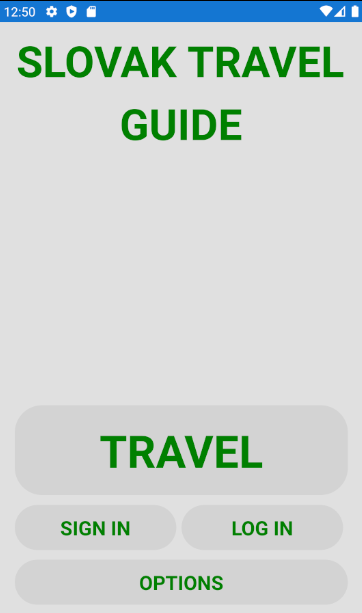
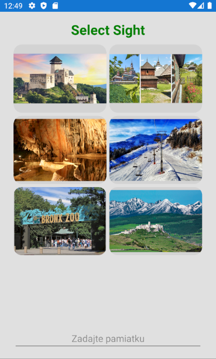
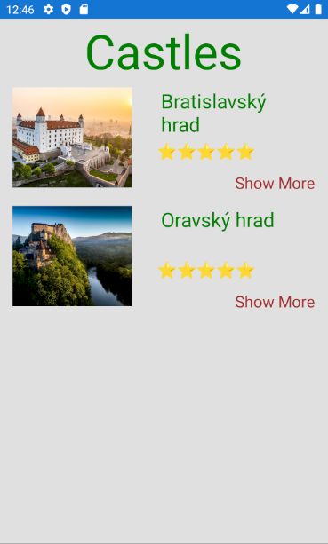
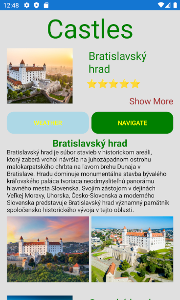

   # Slovak_Travel_Guide

*Aplikácia slúži na preskumávanie pamiatok na Slovensku.*

## 1) Splash screen
  1. Zobrazí sa nám tzv. Loading screen, kde sa nám zobrazí naše vlastnoručné vyrobené logo 

## 2) Úvodná strana

  1. Na vrchu strany názov apky.
  1. Button (travel) - tento button nas prenesie na dalsiu stranku, kde si budeme môcť vybrať možnosť, kde chceme ísť atď..(strana výberu)
  1. Pod buttnom (travel) budú 2 tlačidlá na registrovanie a prihlásenie sa do apky pomocou googlu alebo emailu.
  1. Pod dvoma buttonmi (sign in)(log in) bude button options, kde sa bude nastavovať motív apky, svetlý motív a tmavý motív.

  
## 3) Strana výberu

  1. Min. 2 možnosti ako si vybrať medzi nejakými napr. hradmi, jaskyňami atď...
  1. Keď stlačíme button napr. s hradmi tak nás to presunie na stranu, kde budú hrady, budeme si ich môsť rozkliknúť, zistiť nejaké bližšie info o nich
  1. Ak nebudeme chcieť stránku s hradmi všeobecne, tak dole na stránke sa bude nachádzať Entry, do ktorého budeme môcť zadať názov konkrétneho hradu
  1. V bližšom infe o napr. hradoch budú 2 buttony, jeden na GPS a druhý na počasie:
       GPS button - funkcia po kliknutí taká, že nám nastaví navigáciu s aktuálneho miesta do cieľovej destinácie
       Počasie button - po kliknutí bude ukazovať, aké je na danom mieste počasie
       
## Snímky z aplikácie
**Main Page**

**Select Page**

**Select Castles Page**

**Select Castles Page - Openned**

## 1) Demo (15.3.2021)
  1. do prvého dema stihnúť spojazdniť GPSku, aby sme sa vedeli navigovat pomocou tlačidla na miesto, na ktoré chceme ísť
  2. funkcny splach screen

## 2) Demo (neviem dátum)
   Do druhého dema chcem stihnuť:
   1. Prerobiť kód do MVVM
   2. Spojazdniť "Weather Button", aby sa nám zobrazilo počasie na danom mieste
   3. Spraviť databázu pomocou SQLite
   4. Spraviť SignUp a LogIn pages

*Vytvorili Martinek ale najviac pomáhal Jaro. :)*

